# 1.CoreGraphic
Core Graphic được framework được xây dựng dựa trên công cụ vẽ nâng cao Quartz.

## 1.1 The draw method
Mỗi khi View được hiển thị, mỗi lần view cần được redraw bởi 1 event nào đó, nó sẽ gọi method **draw**. Tuy nhiên phương thức đó chỉ có thể được sử dụng khi ta kế thừa class UIView và triển khai phương thức **draw** đó.
Khi phương thức draw không tự động được gọi, ta có thể sử dụng **setNeedsDisplay or setNeedsDisplayInRect methods** để gọi hàm đó. 

## 1.2 CGContext
Context hình dung như môi trường, chứa toàn bộ các properties, method được sử dụng trong quá trình drawing, ta chỉ cần cấu hình các properties đó, thì context sẽ render ra output ta mong muốn.
Khi gọi tới func draw, func đó cũng khởi tạo 1 context, size của context đó bằng size của parameter rect. Ta cũng nên biết rằng, ta chỉ có thể được draw trên không gian visual content, nếu nằm ngoài khoảng không gian này sẽ bị xoá. 

## 1.3 Drawing Paths
Như đã trình bày ở trên, ta cần 1 biến context để có thể draw. Ta khai báo context như sau:
```php
let context = UIGraphicsGetCurrentContext()
```

Sau đó ta có thể gán giá trị cho các properties để vẽ:
```php
context?.setLineWidth(3.0) 
let colorSpace = CGColorSpaceCreateDeviceRGB()
let components: [CGFloat] = [0.0, 0.0, 1.0, 1.0]
let color = CGColor(colorSpace: colorSpace, components: components)
context?.setStrokeColor(color!)  //Line vẽ có màu blue, alpha = 1.0
///Ta thay color = UIColor.blue.cgColor cũng đúng nhé :)))
```

Sau khi đã gán các properties xong, ta tiếp tục chọn điểm start để vẽ:
```php
context?.move(to: CGPoint(x:100, y: 100))
```

Sau khi chọn xong, ta tiếp tục chọn các điểm tiếp theo để vẽ đường:
```php
context?.addLine(to: CGPoint(x: 150, y: 150))
context?.addLine(to: CGPoint(x: 100, y: 200))
context?.addLine(to: CGPoint(x: 50, y: 150))
context?.addLine(to: CGPoint(x: 100, y: 100))
```
Sau khi có các điểm, ta sẽ vẽ các đường với:
```php
context?.move(to: CGPoint(x:100, y: 100))
```

Kết quả:
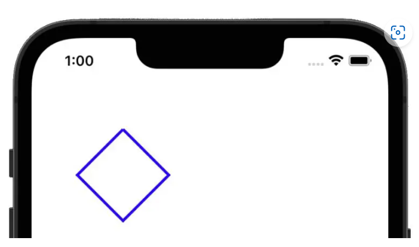

## 1.4 Filling a Path with color
```php
override func draw(_ rect: CGRect)
{
let context = UIGraphicsGetCurrentContext()
context?.move(to: CGPoint(x: 100, y: 100))
context?.addLine(to: CGPoint(x: 150, y: 150))
context?.addLine(to: CGPoint(x: 100, y: 200))
context?.addLine(to: CGPoint(x: 50, y: 150))
context?.addLine(to: CGPoint(x: 100, y: 100))
context?.setFillColor(UIColor.red.cgColor)
context?.fillPath()
}
```

Ta sử dụng method **context?.fillPath()** để fill toàn bộ hình với màu đỏ.

Kết quả:
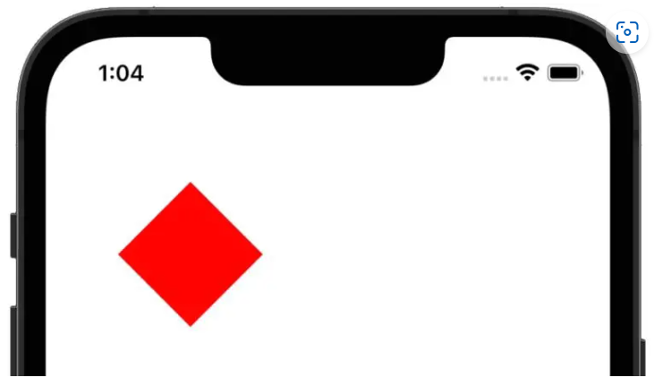

Ta cũng vừa có thể fillPath, vừa có thể set color cho line:
```php
override func draw(_ rect: CGRect)
{
    let context = UIGraphicsGetCurrentContext()
    context?.setLineWidth(4.0)
    context?.setStrokeColor(UIColor.blue.cgColor)
    let rectangle = CGRect(x: 85,y: 100,width: 200,height: 80)
    context?.addRect(rectangle)
    context?.strokePath()
    context?.setFillColor(UIColor.red.cgColor)
    context?.fill(rectangle)
}
```
Lúc này ta tạo 1 hình chữ nhật, sau đó sử dụng **context?.addRect(rectangle)** để add hình chữ nhật đó vào context. Tương tự ta cũng có thể add eclips như **context?.addEllipse(in: rectangle)**. Cuối cùng ta xét fillColor, rồi gọi hàm method **context?.strokePath()** cho vẽ line và method **context?.fill(rectangle)** để fill toàn bộ hình với màu đỏ.
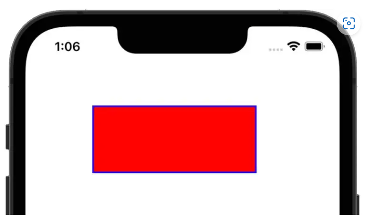

Ta chú ý rằng: 
- Method **fillPath()** sẽ fill toàn bộ Path
- Method **.fill(rectangle)** chỉ fill mỗi hình chữ nhật đó. 

## 1.5 Drawing an Arc
Để vẽ đường cong, ta sử dụng method **addArc()**

```php
func addArcLayer() {
    let shape = CAShapeLayer()
    let path = UIBezierPath()
    path.move(to: CGPoint(x: 90, y: 450))
    path.addLine(to: CGPoint(x: 350, y: 450))
    path.addArc(withCenter: CGPoint(x: 350, y: 400),
                radius: 25,
                startAngle: .pi / 2,
                endAngle: -.pi / 2,
                clockwise: false)
    path.addLine(to: CGPoint(x: 350, y: 350))
    path.addLine(to: CGPoint(x: 90, y: 350))
    path.addArc(withCenter: CGPoint(x: 90, y: 400),
                radius: 25,
                startAngle: -.pi / 2,
                endAngle: .pi / 2,
                clockwise: false)
    path.close()
    
    shape.path = path.cgPath
    shape.strokeColor = UIColor.blue.cgColor
    shape.lineWidth = 3
    shape.fillColor = UIColor.yellow.cgColor
    
    view.layer.addSublayer(shape)
}
```

Output:

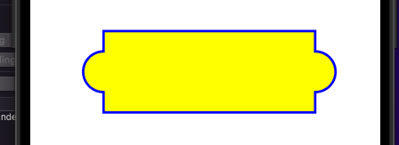

Ta thấy khi addArc, điêm tâm cách tận 50 point tới điểm ở đáy, và khi vẽ, ta vẽ bắt đầu ở điểm **.pi/2.** Nên ta thấy đầu tiên điểm đáy sẽ nối với điểm bắt đầu để tạo nên đường thẳng.

## 1.5 Drawing an Curve
Để vẽ ra 1 đường cong, ta sẽ vẽ kiểu tiếp tuyến. Với ảnh dưới đây có 2 kiểu vẽ đường cong theo tiếp tuyến như sau:
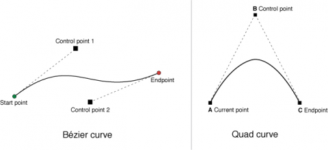
Đó là kiểu:
- addCurve(): Sử dụng 2 điểm Control, sau đó nối điểm control1 đó với điểm start và Control2 với điểm end để được 2 đường tiếp tuyến:
```php
override func draw(_ rect: CGRect) 
{
    let context = UIGraphicsGetCurrentContext()
    context?.setLineWidth(4.0)
    context?.setStrokeColor(UIColor.blue.cgColor)
    context?.move(to: CGPoint(x: 30, y: 30))
    context?.addCurve(to: CGPoint(x: 20, y: 50),
                        control1: CGPoint(x: 300, y: 250),
                        control2: CGPoint(x: 300, y: 70))
    context?.strokePath()
}
```

Output:
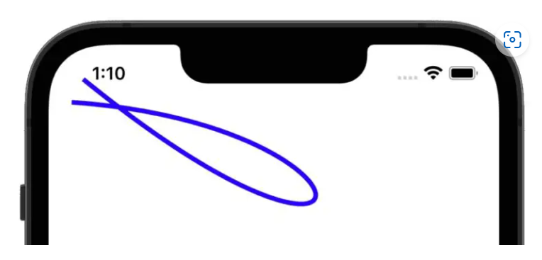

- addQuadCurve: Sử dụng 1 điểm Control, sau đó nối điểm control đó với điểm start và end để được 2 đường tiếp tuyến:
```php
override func draw(_ rect: CGRect)
{
    let context = UIGraphicsGetCurrentContext()
    context?.setLineWidth(4.0)
    context?.setStrokeColor(UIColor.blue.cgColor)
    context?.move(to: CGPoint(x: 10, y: 200))
    context?.addQuadCurve(to: CGPoint(x: 300, y: 200), 
		control: CGPoint(x: 150, y: 10))
    context?.strokePath()
}
```

Output:
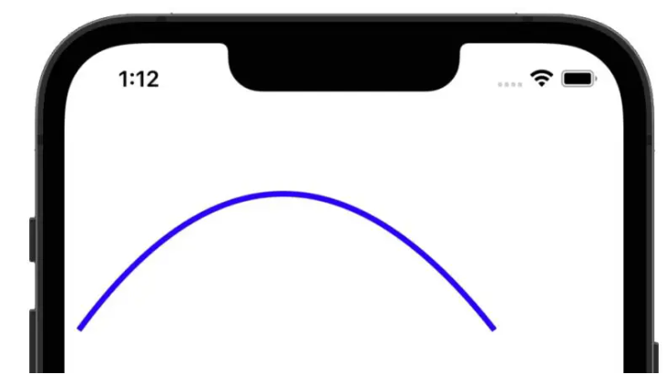


## 1.6 Dashed Line Drawing
Để vẽ đường nét đứt ta sử dụng phương thức **setLineDash()**
```php
override func draw(_ rect: CGRect)
{
    let context = UIGraphicsGetCurrentContext()
    context?.setLineWidth(20.0)
    context?.setStrokeColor(UIColor.blue.cgColor)
    let dashArray:[CGFloat] = [2,6,4,2]
    context?.setLineDash(phase: 3, lengths: dashArray)
    context?.move(to: CGPoint(x: 10, y: 200))
    context?.addQuadCurve(to: CGPoint(x: 300, y: 200), 
		control: CGPoint(x: 150, y: 10))
    context?.strokePath()
}
```

Ta có:
```php
let pattern: [CGFloat] = [12.0, 8.0, 6.0, 14.0, 16.0, 7.0]
```
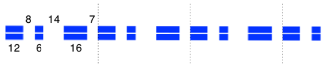
Output:
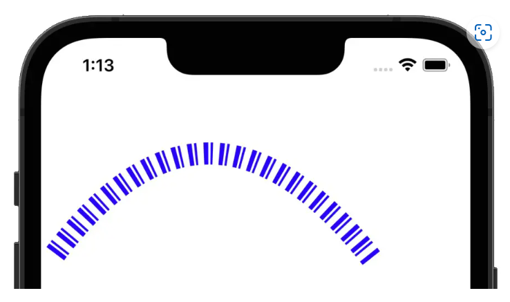


# 2. Thực hành
- Bài toàn 1: Thay vì sử dụng cornel radius, ta sẽ vẽ 1 hình mà được cornel 2 góc topLeft và topRight
Đoạn code 1: (Đây là đoạn code sai)
```php
    override func draw(_ rect: CGRect) {
        let cornelRadius: CGFloat = 150

        let widthRect = rect.width
        let heightRect = rect.height
        let lineWidth: CGFloat = 20
        let context = UIGraphicsGetCurrentContext()
        let startPoint = CGPoint(x: 0, y: heightRect)
        context?.setStrokeColor(UIColor.red.cgColor)
        context?.setLineWidth(lineWidth)

        context?.move(to: startPoint)
        context?.addLine(to: CGPoint(x: 0, y: cornelRadius))
        context?.addQuadCurve(to: CGPoint(x: cornelRadius, y: 0),
                              control: CGPoint(x: 0, y: 0))
        context?.addLine(to: CGPoint(x: widthRect - cornelRadius, y: 0))
        context?.addQuadCurve(to: CGPoint(x: widthRect, y: cornelRadius),
                              control: CGPoint(x: widthRect, y: 0))
        context?.addLine(to: CGPoint(x: widthRect, y: heightRect))
        context?.addLine(to: startPoint)
        context?.setFillColor(UIColor.red.cgColor)
        
        context?.move(to: CGPoint(x: 0, y: rect.height / 2))
        context?.addLine(to: CGPoint(x: rect.width, y: rect.height / 2))
        context?.drawPath(using: .stroke)
    }
  ```

  Output:

  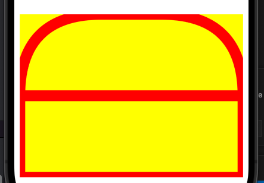

  Ta đã xét **lineWidth = 20**, tuy nhiên ta thấy rằng linewidth của các đường không bằng nhau, lý do bởi vi điểm bắt đầu sẽ là điểm **CGPoint(x: 0, y: heightRect)**, và ta có:

  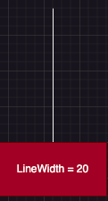.
  
  Ta thấy rằng nó đã mất đi 1 nửa và đi ra rìa phần bên ngoài, và ko thuộc phạm vi của layer nữa nên nó bị mất đi. Và cũng chú ý rằng, **ta xét là xét width của line = 20, còn height của line rất bé**, Để giải quyết vấn đề này, ta phải dịch trục x và y thêm 1 đoạn lineWidth / 2 như sau:
  ```php
override func draw(_ rect: CGRect) {
    let cornelRadius: CGFloat = 150

    let widthRect = rect.width
    let heightRect = rect.height
    let lineWidth: CGFloat = 20
    let context = UIGraphicsGetCurrentContext()
    let startPoint = CGPoint(x: lineWidth / 2, y: heightRect)
    context?.setStrokeColor(UIColor.red.cgColor)
    context?.setLineWidth(lineWidth)

    context?.move(to: startPoint)
    context?.addLine(to: CGPoint(x: lineWidth / 2, y: cornelRadius))
    context?.addQuadCurve(to: CGPoint(x: cornelRadius + lineWidth / 2, y: 0),
                            control: CGPoint(x: lineWidth / 2, y: 0))
    context?.addLine(to: CGPoint(x: widthRect - cornelRadius - lineWidth / 2, y: 0))
    context?.addQuadCurve(to: CGPoint(x: widthRect - lineWidth / 2, y: cornelRadius),
                            control: CGPoint(x: widthRect - lineWidth / 2, y: 0))
    context?.addLine(to: CGPoint(x: widthRect - lineWidth / 2, y: heightRect))
    context?.addLine(to: CGPoint(x: 0, y: move))
    context?.setFillColor(UIColor.red.cgColor)

    context?.move(to: CGPoint(x: 0, y: rect.height / 2))
    context?.addLine(to: CGPoint(x: rect.width, y: rect.height / 2))
    context?.drawPath(using: .stroke)
}
  ```

  Output:


- Bài toán 2: Vẽ Graphic với Gradient

B1: Ta sẽ cornel radius và đổ gradient cho layer.

```php
override func draw(_ rect: CGRect) {
    let cornelpath = UIBezierPath(
        roundedRect: rect,
        byRoundingCorners: .allCorners,
        cornerRadii: Constants.cornerRadiusSize
    )
    cornelpath.addClip()

    guard let context = UIGraphicsGetCurrentContext() else {return}
    let startColor: CGColor = UIColor(red: 250 / 255, green: 233 / 255, blue: 222 / 255, alpha: 1).cgColor
    let endColor: CGColor = UIColor(red: 252 / 255, green: 79 / 255, blue: 8 / 255, alpha: 1).cgColor
    guard let gradient = CGGradient(colorsSpace: CGColorSpaceCreateDeviceRGB(),
                                colors: [startColor, endColor] as CFArray,
                                locations: [0.0, 1.0])
    else {return}
    
    context.drawLinearGradient(gradient,
                                start: CGPoint.zero,
                                end: CGPoint(x: 0, y: rect.height),
                                options: [])

}
```

Hàm cornelpath.addClip() sẽ cut vùng visual content của context theo path của path.
Nên chú ý rằng, ta cần path.addClip() trước khi gọi tới **context.drawLinearGradient()**. Bởi vì gtadient sẽ được full fill với vùng visual content của context, nên ta cần addClip().

Output:

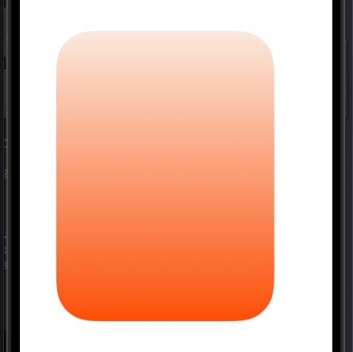

B2: Ta sẽ tạo điểm:

```php
let path = UIBezierPath()
    let points = [CGPoint(x: 10, y: 100),
                    CGPoint(x: 60, y: 150),
                    CGPoint(x: 110, y: 60),
                    CGPoint(x: 140, y: 50),
                    CGPoint(x: 180, y: 30),
                    CGPoint(x: 220, y: 130)]
    points.forEach { point in
        if points.first == point {
            path.move(to: point)
            return
        }
        
        path.addLine(to: point)
    }
    
    UIColor.white.setStroke()
    path.lineWidth = 3
    path.stroke()
```

Output:

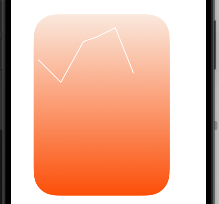

B3: Ta sẽ apply gradient cho vùng điểm đó, cần chú ý rằng, với việc context.context.drawPath(using: .strokeFill) sẽ chỉ fill được 1 màu mà ko fill được màu theo gradient.

Ý tưởng fill màu theo gradient ở đây là ta sẽ tạo 1 path trùng với path vẽ đường, sau đó addClip() path đó để cut vùng visual content context, sau đó đổ gradient cho vùng context thông qua **drawLinearGradient()**.

```php
path.lineWidth = 3
path.stroke()
context.saveGState()

guard let clippingPath = path.copy() as? UIBezierPath else {return}
clippingPath.addLine(to: CGPoint(x: clippingPath.currentPoint.x, y: rect.height))
clippingPath.addLine(to: CGPoint(x: points[0].x, y: rect.height))
clippingPath.close()
clippingPath.addClip()

let startColorGraph: CGColor = UIColor.red.cgColor
let endColorGraph: CGColor = UIColor.green.cgColor
guard let gradientGraph = CGGradient(colorsSpace: CGColorSpaceCreateDeviceRGB(),
                            colors: [startColorGraph, endColorGraph] as CFArray,
                                        locations: [0.0, 1.0]) else {return}
context.drawLinearGradient(gradientGraph,
                            start: CGPoint(x: 0, y: 0),
                            end: CGPoint(x: 220, y: rect.height),
                            options: [])

context.restoreGState()

points.forEach { point in
    let path = UIBezierPath(arcCenter: point,
                            radius: 4,
                            startAngle: 0,
                            endAngle: .pi * 2,
                            clockwise: true)
    path.fill()
    path.stroke()
}

```

Ở bước này ta có 1 điểm lưu ý, vì ở trên ta có gọi **clippingPath.addClip()** nên vùng không gian ***context*** đã bị cắt. Dẫn đến các điểm nằm ngoài vùng không gian ta vẽ sau sẽ bị xoá. Nên ta cần gọi **context.saveGState()** để lưu trữ vùng không gian đó. Sau đó gọi hàm **context.restoreGState()** để lấy lại vùng không gian đó để các chấm tròn không bị cắt mất

Output với việc sử dụng **restoreGState**:

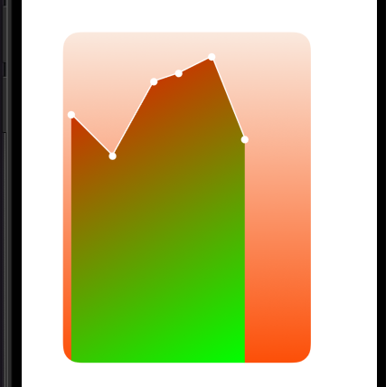

Output với việc ko sử dụng **restoreGState**:

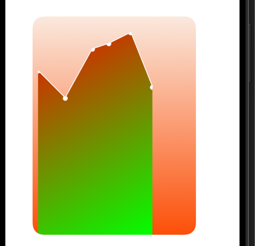
