# I. Overview

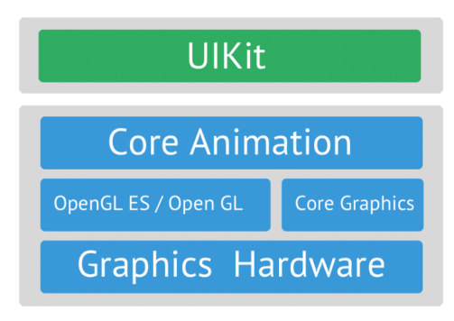

Khi ta khởi tạo 1 View, UIView cũng tự động khởi tạo 1 đối tượng CALayer cho view đó. Layer là 1 phần của CoreAnimation, chịu trách nhiệm cho việc render visual content cho chính view đó. 

Các vai trò của View, layer, CoreGraphic
- CALayer: Có nhiệm vụ render, hiển thị content, tạo animation.
- UIView: Có nhiệm vụ nhận input người dùng.
- CoreGraphic: Có nhiệm vụ create và render 2D Graphic như draw lines, rectangles,... Image Manipulation như resizing, scalling, scropping image. Coordinate Transformations như translate, rotate, scale,...

Mối quan hệ Layer và CoreGraphic:
  
Ta biết rằng, layer có nhiệm vụ render và hiển thị content. Nhưng sâu xa hơn, layer sử dụng Core Graphic để thực hiện các chức năng đó. VD khi ta update các properties như backgroundColor, borderColor, shadowColor hoặc contents của layer,... hoặc là khi ta rotate, translate,... thì layer sử dụng CoreGraphic để update và render các thay đổi đó. Ta có thể tương tác trực tiếp với CoreGraphic như việc triển khải **draw(_ rect: CGRect)** method of a UIView subclass or using **draw(in ctx: CGContext)** method of a **CALayerDelegate.**

# II. CALayer
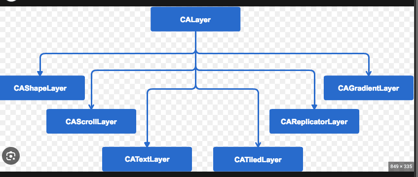

Như đã nêu trên, layer có nhiệm vụ render ra content, để chứng minh điều đó, từ layer ta sẽ add text, image.

- Add image:

```php
view.backgroundColor = .white
let redView = UIView(frame: .init(x: 100, y: 300, width: 300, height: 300))
view.addSubview(redView)
let imageLayer = CALayer()
imageLayer.frame = redView.bounds
imageLayer.contents = UIImage(named: "bp")?.cgImage
imageLayer.contentsGravity = .topLeft

imageLayer.isGeometryFlipped = true  // Xét true để không bị lộn ngược top và bottom
print("DEBUG: \(imageLayer.contentsAreFlipped())")

redView.layer.addSublayer(imageLayer)

redView.layer.borderColor = UIColor.blue.cgColor
redView.layer.backgroundColor = UIColor.red.cgColor
```

Output:

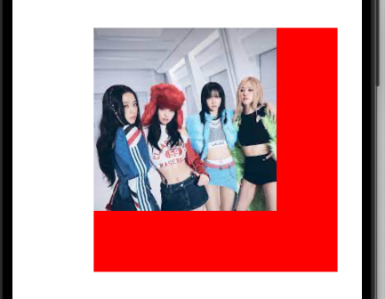

Ta xét contentMode cho content của layer như UIImageView thông qua property **contentsGravity:** Với imageLayer.contentsGravity = .resizeAspectFill

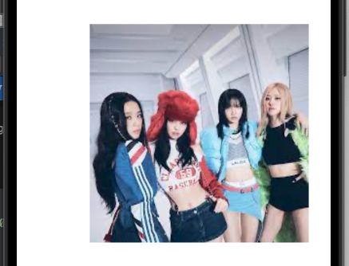

- Add Text: CATextLayer

```php
func addTextLayer (){
    let textLayer = CATextLayer()
    textLayer.string = "Hellooooooooo \n Siuuuuu \n 1231321"
    textLayer.foregroundColor = UIColor.white.cgColor
    textLayer.alignmentMode = .left
    textLayer.fontSize = 17
    textLayer.truncationMode = .none
    textLayer.backgroundColor = UIColor.red.cgColor
    textLayer.frame = CGRect(origin: CGPoint.zero, size: .init(width: 100, height: 60))
    redView.layer.addSublayer(textLayer)
}
```

Output:

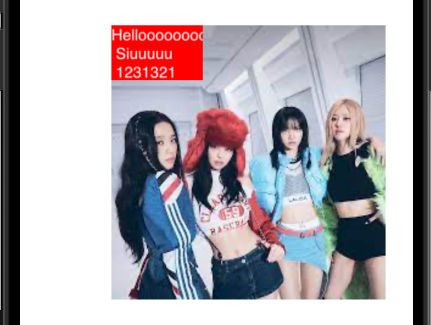

## 2.1. CAShapeLayer
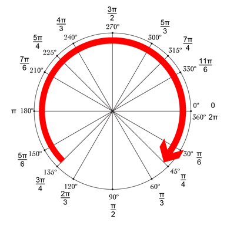

CAShapeLayer là 1 subClass của CALayer, được sử dụng để drawing và animate shapes.

```php
func addShapeLayer() {
    var startPoint: CGPoint = CGPoint(x: 0, y: 0)
    
    let shape = CAShapeLayer()
    let path = UIBezierPath(arcCenter: CGPoint(x: view.frame.midX, y: 150), radius: 90, startAngle: .pi * 2 / 3, endAngle: .pi / 3, clockwise: true)
    path.cgPath.applyWithBlock { point in
        if point.pointee.type == .moveToPoint {
            startPoint = point.pointee.points[0]
        }
    }
    
    path.addLine(to: CGPoint(x: path.currentPoint.x + 30, y: path.currentPoint.y))
    path.addLine(to: CGPoint(x: path.currentPoint.x, y: path.currentPoint.y + 60))
    path.addLine(to: CGPoint(x: startPoint.x - 30 , y: path.currentPoint.y))
    path.addLine(to: CGPoint(x: path.currentPoint.x , y: path.currentPoint.y - 60))
    path.addLine(to: startPoint)

    shape.path = path.cgPath
    shape.lineWidth = 3
    shape.strokeColor = UIColor.gray.cgColor
    shape.fillColor = UIColor.red.cgColor
    view.layer.addSublayer(shape)
}
```

Chú ý đoạn code này:
```php
path.cgPath.applyWithBlock { point in
    if point.pointee.type == .moveToPoint {
        startPoint = point.pointee.points[0]
    }
}
```

Output:

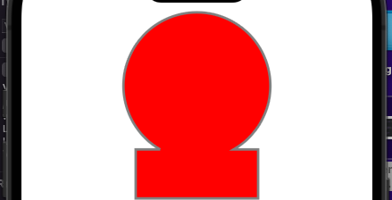

## 2.2 CAGradient

Để tạo gradient, ta phải xét các thông số sau:
- frame
- startPoint
- endPoint
- colors
- locations


## 2.3 CABasicAnimation

So sánh API UIKit và Core Animation cho việc animating 1 View:
- UIView.animte(),...: Sẽ so sánh sự khác nhau giữa giá trị đầu và giá trị cuối cùng trong closure animations để tạo animation, nếu không có sự khác biệt thì sẽ không có animation.

```php
UIView.animate(withDuration: 2) {
    self.redView.transform = CGAffineTransform(rotationAngle: .pi * 2.0)
}
```

Vì sau khi xoay 360 độ thì vị trí view vẫn thế nên sẽ không có animation trong VD trên.

- Sẽ luôn có animation trong mọi trường hợp, giá trị bắt đầu là start point, giá trị cuối là end point(Xét start point == end point sẽ ko có animation :)))

- Với UIView.animate(): Sử dụng 2 transform liên tiếp thì transform sau sẽ khi đè lên transform trước, nên transfrom trước sẽ ko có animation. Ta có thể sử dụng CGAffineTransform().concatenating() để nối 2 transfrom.

- Nhiều animation được add vào layer sẽ được thực thi cùng lúc.

### 2.3.0 Giới thiệu
Ta có thể animation những properties này:
- backgroundColor
- rotation
- translation
- scale
- opacity
- size
- borderWidth
- cornelRadius
- shadowOffset
- shadowOpacity
- shadowColor

**Anchor Point**: Là điểm mà layer sẽ animate xung quanh. Giá trị default là: (0.5, 0.5) ứng với tâm của layer.

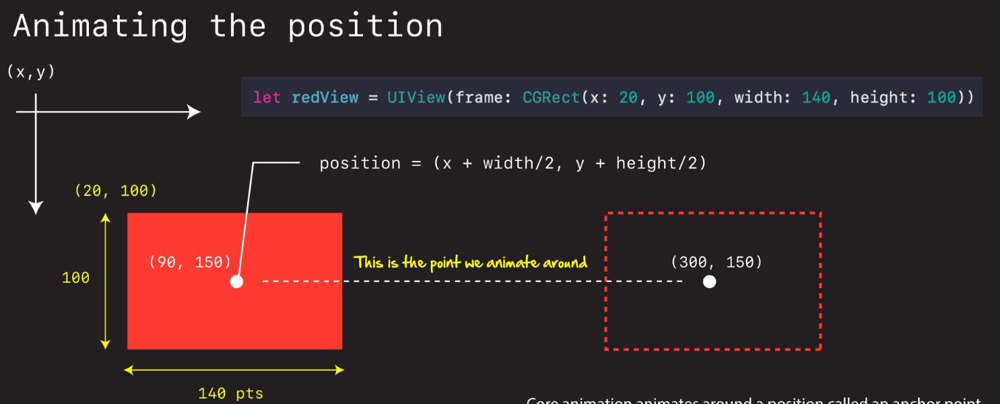

### 2.3.1 Move
- CoreAnimation:

```php
let redView = UIView(frame: CGRect(x: 50, y: 200, width: 150, height: 150))
func moveAnimate() {
    let animation = CABasicAnimation(keyPath: "position.x")
    animation.fromValue = 150 / 2 + 50
    animation.toValue = 150 / 2 + 50 + 200
    animation.duration = 2
    animation.repeatCount = 2
    print("DEBUG: \(redView.layer.anchorPoint)")
    
    redView.layer.add(animation, forKey: "move.x")
    redView.layer.position.x = 150 / 2 + 50 + 200
}
```
- UIKit

```php
func moveAnimate() {
    UIView.animate(withDuration: 2) {
        self.redView.transform = CGAffineTransform(translationX: 200, y: 0)
    }
}
    
```

Output:


### 2.3.2 Scale + move
- Core Animation:

```php
func scaleAnimate() {
    let move = CABasicAnimation(keyPath: "position.x")
    move.fromValue = 150 / 2 + 50
    move.toValue = 150 / 2 + 50 + 200
    move.duration = 2
    move.repeatCount = 2
    
    let scale = CABasicAnimation(keyPath: "transform.scale.x")
    scale.fromValue = 0.2
    scale.toValue = 2
    scale.duration = 2

    redView.layer.add(move, forKey: "move.x")
    redView.layer.add(scale, forKey: "scale")
    redView.layer.position.x = 150 / 2 + 50 + 200
}
```

Output:

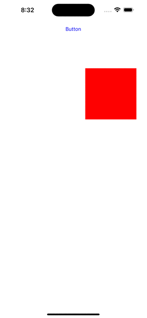

Khi muốn xoá animation, ta có thể sử dung:
```php
redView.layer.removeAnimation(forKey: "move.x")
```

Tuy nhiên với UIKit, khi di chuyển trục x, hoặc y mà scaleX < 1, hoặc tương ứng scaleY < 1, thì sẽ không di chuyển được, còn > 1 thì đúng.

```php
func scaleAnimate() {
    let transformX = CGAffineTransform(translationX: 150, y: 0)
    let transformScale = CGAffineTransform(scaleX: 0.2, y: 1.5)
    let combine = transformX.concatenating(transformScale)
    UIView.animate(withDuration: 2) {
        self.redView.transform = combine
    }
}
```

Output:

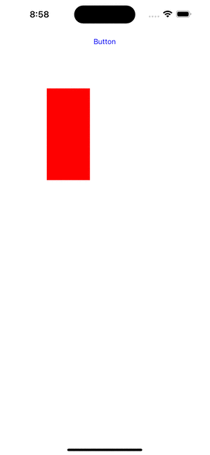

**Đó là lý do tại sao chúng ta cần dùng CoreAnimation ?**

### 2.3.3 Scale + Rotate + Keyframe

**CAPropertyAnimation** that allows you to animate an object's property with a series of values instead of just a single starting and ending value.

```php
func keyframeAnimte() {
    let keyframeX = CAKeyframeAnimation(keyPath: "transform.scale.x")
    keyframeX.values = [1, 2 , 1, 0.5, 1]
    keyframeX.keyTimes = [0, 0.25, 0.5, 0.75, 1]
    keyframeX.duration = 2
    keyframeX.repeatDuration = .infinity
    
    let keyframeY = CAKeyframeAnimation(keyPath: "transform.scale.y")
    keyframeY.values = [1, 2 , 1, 0.5, 1]
    keyframeY.keyTimes = [0, 0.25, 0.5, 0.75, 1]
    keyframeY.duration = 2
    keyframeY.repeatDuration = .infinity
    
    let rotate = CABasicAnimation(keyPath: "transform.rotation.z")
    rotate.fromValue = 0
    rotate.toValue = CGFloat.pi * 2
    rotate.duration = 2
    rotate.repeatDuration = .infinity
    
    redView.layer.add(keyframeX, forKey: "scaleX")
    redView.layer.add(keyframeY, forKey: "scaleY")
    redView.layer.add(rotate, forKey: "rotate")
}
```

Giải thích: Ta xét:
```php
keyframeY.values = [1, 2 , 1, 0.5, 1]
keyframeY.keyTimes = [0, 0.25, 0.5, 0.75, 1]
keyframeY.duration = 2
```
Nghĩa là trong thời gian (0 -> 0.25) * duration redView sẽ được scale 2 lần trong thời gian từ 0 dến 0.5s... Tương tự như thế.

Output:

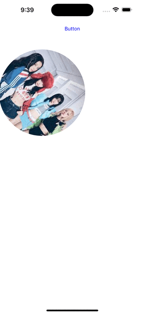

Hmm, vì cái này xoay 360 độ, nên so với vị trí ban đầu nó ko thay đổi gì, nên ko có animation khi sử dụng UIView.animate()....
