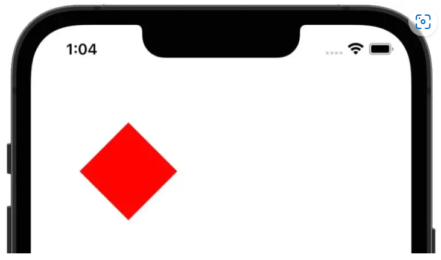
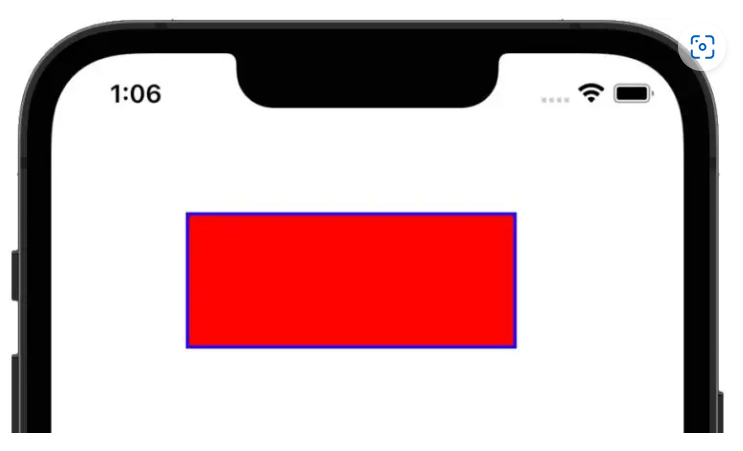
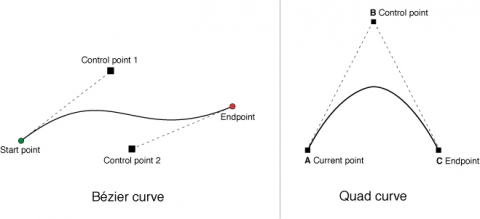
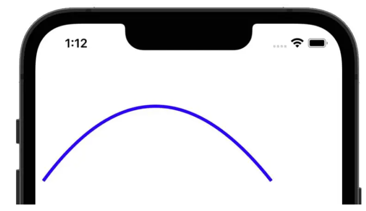
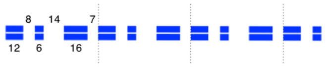

# 1.CoreGraphic
Core Graphicdđoc framework được xây dựng dựa trên công cụ vẽ nâng cao Quartz.

## 1.1 The draw method
Mỗi khi View được hiển thị, mỗi lần view cần được redraw bởi 1 event nào đó, nó sẽ gọi method **draw**. Tuy nhiên phương thức đó chỉ có thể được sử dụng khi ta kế thừa class UIView và triển khai phương thức **draw** đó.
Khi phương thức draw không tự động được gọi, ta có thể sử dụng **setNeedsDisplay or setNeedsDisplayInRect methods** để gọi hàm đó. 

## 1.2 CGContext
Context là môi trường, chứa toàn bộ các properties, method được sử dụng trong quá trình drawing, ta chỉ cần cấu hình các properties đó, thì context sẽ render ra output ta mong muốn.


## 1.3 Drawing Paths
Như đã trình bày ở trên, ta cần 1 biến context để có thể draw. Ta khai báo context như sau:
```php
let context = UIGraphicsGetCurrentContext()
```

Sau đó ta có thể gán giá trị cho các properties để vẽ:
```php
context?.setLineWidth(3.0) 
let colorSpace = CGColorSpaceCreateDeviceRGB()
let components: [CGFloat] = [0.0, 0.0, 1.0, 1.0]
let color = CGColor(colorSpace: colorSpace, components: components)
context?.setStrokeColor(color!)  //Line vẽ có màu blue, alpha = 1.0
///Ta thay color = UIColor.blue.cgColor cũng đúng nhé :)))
```

Sau khi đã gán các properties xong, ta tiếp tục chọn điểm start để vẽ:
```php
context?.move(to: CGPoint(x:100, y: 100))
```

Sau khi chọn xong, ta tiếp tục chọn các điểm tiếp theo để vẽ đường:
```php
context?.addLine(to: CGPoint(x: 150, y: 150))
context?.addLine(to: CGPoint(x: 100, y: 200))
context?.addLine(to: CGPoint(x: 50, y: 150))
context?.addLine(to: CGPoint(x: 100, y: 100))
```
Sau khi có các điểm, ta sẽ vẽ các đường với:
```php
context?.move(to: CGPoint(x:100, y: 100))
```

Kết quả:


## 1.4 Filling a Path with color
```php
override func draw(_ rect: CGRect)
{
let context = UIGraphicsGetCurrentContext()
context?.move(to: CGPoint(x: 100, y: 100))
context?.addLine(to: CGPoint(x: 150, y: 150))
context?.addLine(to: CGPoint(x: 100, y: 200))
context?.addLine(to: CGPoint(x: 50, y: 150))
context?.addLine(to: CGPoint(x: 100, y: 100))
context?.setFillColor(UIColor.red.cgColor)
context?.fillPath()
}
```

Ta sử dụng method **context?.fillPath()** để fill toàn bộ hình với màu đỏ.

Kết quả:


Ta cũng vừa có thể fillPath, vừa có thể set color cho line:
```php
override func draw(_ rect: CGRect)
{
    let context = UIGraphicsGetCurrentContext()
    context?.setLineWidth(4.0)
    context?.setStrokeColor(UIColor.blue.cgColor)
    let rectangle = CGRect(x: 85,y: 100,width: 200,height: 80)
    context?.addRect(rectangle)
    context?.strokePath()
    context?.setFillColor(UIColor.red.cgColor)
    context?.fill(rectangle)
}
```
Lúc này ta tạo 1 hình chữ nhật, sau đó sử dụng **context?.addRect(rectangle)** để add hình chữ nhật đó vào context. Tương tự ta cũng có thể add eclips như **context?.addEllipse(in: rectangle)**. Cuối cùng ta xét fillColor, rồi gọi hàm method **context?.strokePath()** cho vẽ line và method **context?.fill(rectangle)** để fill toàn bộ hình với màu đỏ.


Ta chú ý rằng: 
- Method **fillPath()** sẽ fill toàn bộ Path
- Method **.fill(rectangle)** chỉ fill mỗi hình chữ nhật đó. 

## 1.5 Drawing an Curve
Để vẽ ra 1 đường cong, ta sẽ vẽ kiểu tiếp tuyến. Với ảnh dưới đây có 2 kiểu vẽ đường cong theo tiếp tuyến như sau:

Đó là kiểu:
- addCurve(): Sử dụng 2 điểm Control, sau đó nối điểm control1 đó với điểm start và Control2 với điểm end để được 2 đường tiếp tuyến:
```php
override func draw(_ rect: CGRect) 
{
    let context = UIGraphicsGetCurrentContext()
    context?.setLineWidth(4.0)
    context?.setStrokeColor(UIColor.blue.cgColor)
    context?.move(to: CGPoint(x: 30, y: 30))
    context?.addCurve(to: CGPoint(x: 20, y: 50),
                        control1: CGPoint(x: 300, y: 250),
                        control2: CGPoint(x: 300, y: 70))
    context?.strokePath()
}
```

Output:


- addQuadCurve: Sử dụng 1 điểm Control, sau đó nối điểm control đó với điểm start và end để được 2 đường tiếp tuyến:
```php
override func draw(_ rect: CGRect)
{
    let context = UIGraphicsGetCurrentContext()
    context?.setLineWidth(4.0)
    context?.setStrokeColor(UIColor.blue.cgColor)
    context?.move(to: CGPoint(x: 10, y: 200))
    context?.addQuadCurve(to: CGPoint(x: 300, y: 200), 
		control: CGPoint(x: 150, y: 10))
    context?.strokePath()
}
```

Output:



## 1.6 Dashed Line Drawing
Để vẽ đường nét đứt ta sử dụng phương thức **setLineDash()**
```php
override func draw(_ rect: CGRect)
{
    let context = UIGraphicsGetCurrentContext()
    context?.setLineWidth(20.0)
    context?.setStrokeColor(UIColor.blue.cgColor)
    let dashArray:[CGFloat] = [2,6,4,2]
    context?.setLineDash(phase: 3, lengths: dashArray)
    context?.move(to: CGPoint(x: 10, y: 200))
    context?.addQuadCurve(to: CGPoint(x: 300, y: 200), 
		control: CGPoint(x: 150, y: 10))
    context?.strokePath()
}
```

Ta có:
```php
let pattern: [CGFloat] = [12.0, 8.0, 6.0, 14.0, 16.0, 7.0]
```

Output:

